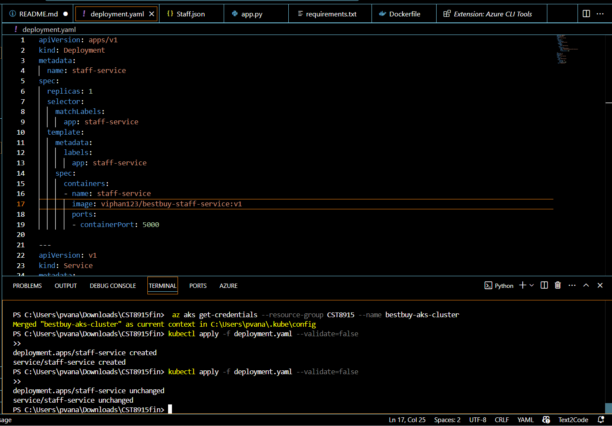
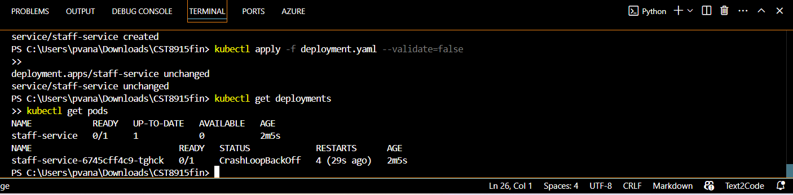
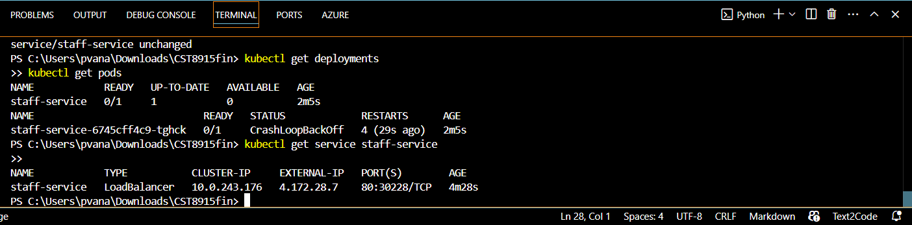
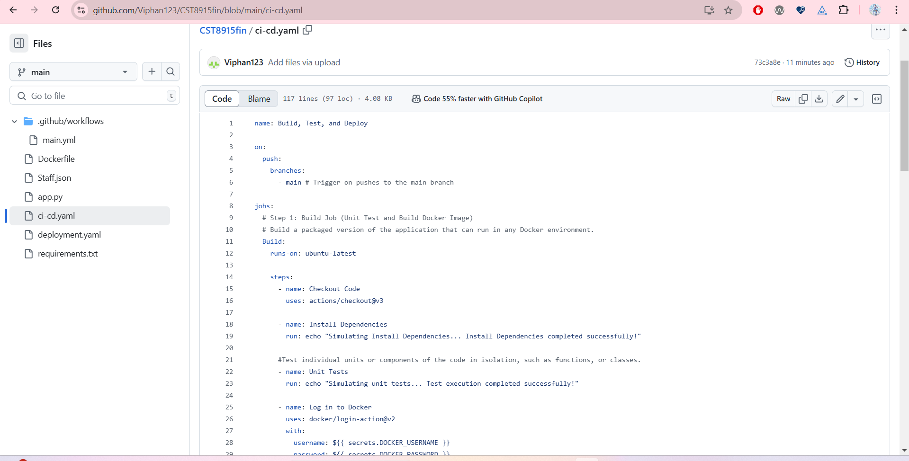
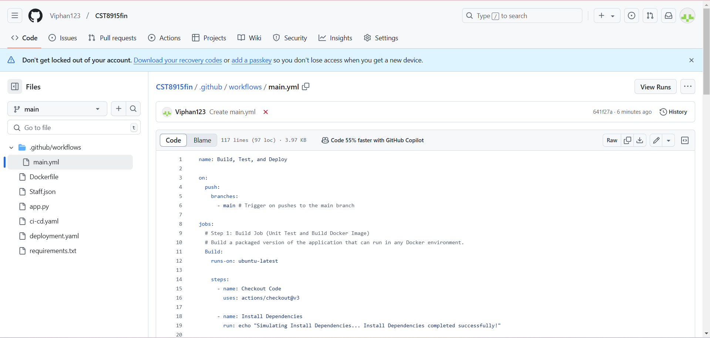

# BestBuy Staff-Service Microservice

## Description
This microservice manages staff information for Best Buy's internal system. It provides CRUD operations via REST APIs to create, read, update, and delete staff data. The data is stored in memory, with no external database.
## Application
The initial application is developed using Python flask in the app.py file, using a sample json database staff.json. 

## API Endpoints
- **POST /staff**: Create a new staff member.
- **GET /staff/{id}**: Retrieve staff information by ID.
- **PUT /staff/{id}**: Update staff information by ID.
- **DELETE /staff/{id}**: Delete staff member by ID.

## Docker Image
The Docker image for the staff-service is available at [Docker Hub](https://hub.docker.com/repository/docker/viphan123/bestbuy-staff-service).
After creating the app.py, I create a dockerfile, build and push it onto Docker Hub.
```
docker build -t viphan123/bestbuy-staff-service:v1 .
docker push viphan123/bestbuy-staff-service:v1
```
Link: https://hub.docker.com/repository/docker/viphan123/bestbuy-staff-service

## Deploying to AKS
After creating an Azure Kubernetes Cluster, I try to deploy my microservice to AKS.

Verification result:

You can connect to my app using this external IP:

## Set up a CI/CD pipeline
I set up a CI/CD pipeline using the provided yaml file.


## Testing the CI/CD pipeline
However, since I use email to log into Dockerfile and do not know my password, this step isn't fully completed.


## Tasks Completed
1. Developed a REST API for managing staff data.
2. Containerized the service using Docker.
3. Deployed the service to Azure Kubernetes Service (AKS).
4. Set up a CI/CD pipeline with GitHub Actions for automatic builds and deployments.
5. Testing the pipeline

## Technical Issues Encountered
- Encountered challenges with configuring the AKS cluster and ensuring the Docker image was compatible with the Kubernetes deployment.
- CI/CD pipeline issue

